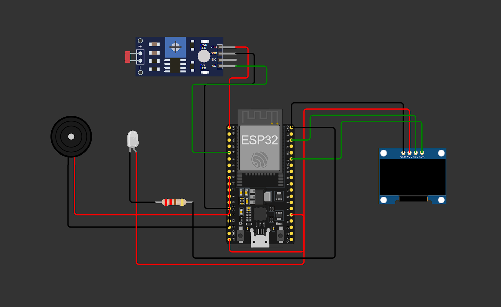

# Sistema de Iluminação Inteligente

Este repositório implementa um sistema de **monitoramento inteligente de luminosidade**, utilizando um ESP32, sensor LDR (fotoresistor), LED indicador, buzzer de alerta e display OLED SSD1306. A comunicação ocorre via protocolo MQTT, permitindo monitoramento remoto da luminosidade do ambiente em tempo real.

---

## 📷 Protótipo

> *Simulação feita no Wokwi.*



---

## 🔧 Componentes Utilizados

- **Placa:** ESP32 DevKit V4 (simulado no Wokwi)
- **Sensor:** 1× LDR (Fotoresistor)
- **Atuadores:**
  - 1× LED branco (indicação de ambiente escuro)
  - 1× Buzzer (alerta sonoro)
- **Display:** OLED SSD1306 128×64 I2C (endereço `0x3C`)
- **Comunicação:** Wi-Fi + MQTT via `broker.emqx.io:1883`

---

## ⚙️ Como Funciona

### 1. Leitura da Luminosidade

O sensor LDR mede a intensidade luminosa do ambiente através de uma leitura analógica realizada pelo ESP32.

### 2. Conversão para Porcentagem

O valor lido pelo sensor é convertido para uma escala percentual de luminosidade entre 0% e 100%.

### 3. Controle dos Atuadores

- Se a luminosidade for **menor ou igual a 20%**:
  - O **LED acende**;
  - O **buzzer é acionado**;
  - O sistema identifica o ambiente como **ESCURO**.

- Se a luminosidade for **maior que 20%**:
  - O **LED permanece apagado**;
  - O **buzzer é desligado**;
  - O sistema identifica o ambiente como **CLARO**.

### 4. Exibição Local

O display OLED apresenta em tempo real:

- Percentual de luminosidade;
- Estado atual do ambiente (CLARO ou ESCURO).

### 5. Comunicação MQTT

O ESP32 publica informações periodicamente nos seguintes tópicos:

- `iluminacao/valor` → Percentual de luminosidade do ambiente.
- `iluminacao/estado` → Estado atual do ambiente.

Configuração MQTT:

- Broker: `broker.emqx.io`
- Porta: `1883`
- Biblioteca: PubSubClient para ESP32.

---

## 📁 Estrutura de Arquivos

```plaintext
├── sketch.ino
├── diagram.json
├── libraries.txt
└── imagens/
    └── prototipo.png
```

### Descrição dos Arquivos

| Arquivo | Descrição |
|----------|----------|
| `sketch.ino` | Código principal do projeto |
| `diagram.json` | Diagrama do circuito no Wokwi |
| `libraries.txt` | Bibliotecas necessárias |
| `imagens/prototipo.png` | Imagem do protótipo |

---

## 🚀 Simulação no Wokwi

1. Acesse https://wokwi.com
2. Crie um novo projeto ESP32.
3. Faça upload dos arquivos:
   - `sketch.ino`
   - `diagram.json`
   - `libraries.txt`
4. Clique em **Start Simulation**.
5. Abra o **Serial Monitor** para visualizar as leituras de luminosidade.
6. Observe o **OLED**, o **LED** e o **buzzer** respondendo às variações de luz do ambiente.

---

## 🌐 Interfaces e Protocolos

Este projeto utiliza comunicação via protocolo **MQTT (Message Queuing Telemetry Transport)** com os seguintes parâmetros:

- **Broker:** `broker.emqx.io`
- **Porta:** `1883`
- **Transporte:** TCP/IP
- **Biblioteca MQTT:** PubSubClient

### Publicações (ESP32 → Broker)

| Tópico | Descrição |
|---------|---------|
| `iluminacao/valor` | Percentual de luminosidade do ambiente |
| `iluminacao/estado` | Estado do ambiente (Luz ligada ou Luz desligada) |

---

## 📊 Exemplo de Funcionamento

| Luminosidade | Ambiente | LED | Buzzer |
|-------------|-----------|------|---------|
| 0% a 20% | ESCURO | Ligado | Ligado |
| 21% a 100% | CLARO | Desligado | Desligado |

---

## 🔄 Possíveis Extensões

- Controle automático de lâmpadas residenciais;
- Integração com sistemas de automação residencial;
- Dashboard web para monitoramento em tempo real;
- Notificações automáticas quando o ambiente permanecer escuro por longos períodos;
- Integração com assistentes virtuais e plataformas IoT.

---

## 👨‍💻 Autor

Projeto desenvolvido para fins acadêmicos utilizando ESP32, MQTT e simulação no Wokwi.

---

## 📜 Licença

Este projeto está licenciado sob a MIT License. Consulte o arquivo `LICENSE` para mais informações.
